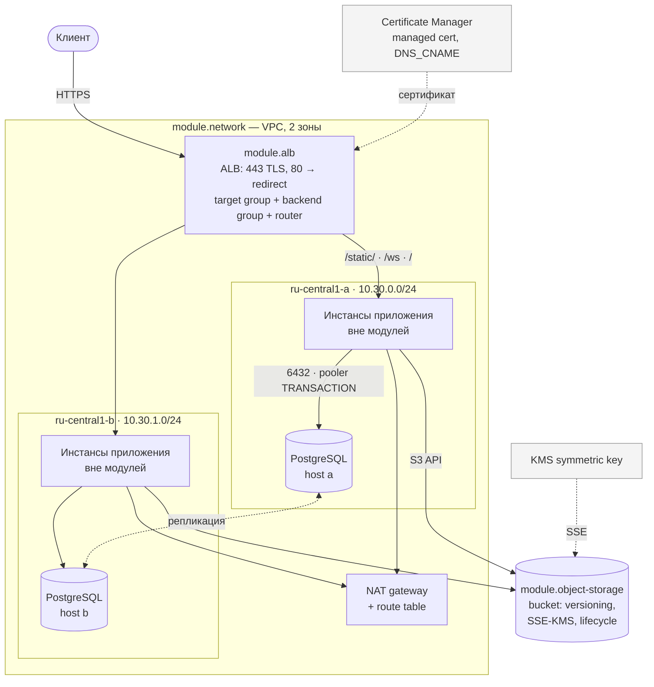

# terraform-yandex-modules

Библиотека переиспользуемых Terraform-модулей для Yandex Cloud: сеть, Managed Kubernetes,
Managed PostgreSQL, Object Storage, Application Load Balancer и IAM — с типизированными
входами, валидацией и проверками в CI.

## Задача

Инфраструктура в Yandex Cloud обычно начинается с одного каталога `terraform/`, где лежат
`network.tf`, `k8s.tf`, `db.tf`. Появляется второе окружение — каталог копируется. Появляется
третье — копируется ещё раз. Дальше начинается то, ради чего этот репозиторий и существует:

- **дрейф.** В prod у кластера PostgreSQL retention 14 дней, в staging — 7, потому что кто-то
  правил только один каталог. Узнают об этом в момент, когда бэкап нужен.
- **ошибки повторяются столько раз, сколько копий.** Забытый `noncurrent_version_expiration`
  на бакете с версионированием — это счёт за хранение, растущий линейно и незаметно;
  в трёх копиях он растёт втрое.
- **знание не фиксируется.** Что preemptible-узел без `auto_repair` тихо исчезает навсегда,
  знает один человек. В коде этого нет, в ревью это не всплывает.
- **ревью нечего проверять.** Диф на 400 строк, повторяющий предыдущий диф на 400 строк,
  читают по диагонали.

Модуль решает это не «переиспользованием кода» как самоцелью, а тем, что превращает
эксплуатационное знание в проверяемое ограничение. Если preemptible-группа обязана иметь
`auto_repair`, это `validation`-блок, а не абзац в Confluence. Если PRODUCTION-кластер БД
должен стоять минимум в двух зонах, `terraform plan` падает до создания ресурсов, а не
инженер вспоминает об этом во время инцидента.

Второе следствие: интерфейс модуля — это документация. Таблица входов в README каждого
модуля генерируется из кода `terraform-docs`, и CI падает, если она разошлась с кодом.

## Каталог модулей

| Модуль | Назначение | Ключевые входы |
|---|---|---|
| [`network`](modules/network) | VPC, подсети по зонам, общий NAT-шлюз с таблицей маршрутизации, security-группы | `subnets` (карта зона + CIDR + `route_via_nat`), `security_groups`, `enable_nat_gateway` |
| [`kubernetes`](modules/kubernetes) | Managed Service for Kubernetes: региональный или зональный мастер, группы узлов, KMS-ключ для секретов | `master_type`, `master_locations`, `node_groups` (карта: scale, preemptible, labels, taints), `create_kms_key` |
| [`postgresql`](modules/postgresql) | Кластер Managed PostgreSQL: версия, класс хостов, диск, окно бэкапа, PITR, пользователи и базы | `hosts`, `resource_preset_id`, `backup_retain_period_days`, `users`, `databases`, `restore` |
| [`object-storage`](modules/object-storage) | Бакет Object Storage: версионирование, lifecycle, SSE-KMS, ACL/политика, сервис-аккаунт со статическим ключом | `bucket_name`, `lifecycle_rules`, `enable_server_side_encryption`, `acl`, `policy` |
| [`alb`](modules/alb) | Application Load Balancer: целевая группа, backend-группа с health-check, HTTP-роутер, TLS-listener | `locations`, `targets`, `healthcheck`, `routes`, `managed_certificate` / `certificate_id` |
| [`iam`](modules/iam) | Сервис-аккаунты и привязки ролей одной картой, по принципу наименьших привилегий | `service_accounts` (карта: `folder_roles`, `cloud_roles`, ключи) |

## Архитектура примера `web-app`



Security-группы задают границы: `alb` принимает 443 и 80 из интернета, `database` — только
6432 из подсетей приложения, базовая группа разрешает трафик внутри себя и health-check'и
балансировщика. Больше снаружи не слушает ничего.

## Быстрый старт

```hcl
module "network" {
  source = "github.com/lpogosu/terraform-yandex-modules//modules/network?ref=v1.0.0"

  name_prefix = "prod"
  folder_id   = var.folder_id

  subnets = {
    a = { zone = "ru-central1-a", v4_cidr_blocks = ["10.10.0.0/24"] }
    b = { zone = "ru-central1-b", v4_cidr_blocks = ["10.10.1.0/24"] }
  }
}

module "database" {
  source = "github.com/lpogosu/terraform-yandex-modules//modules/postgresql?ref=v1.0.0"

  name       = "prod-pg"
  folder_id  = var.folder_id
  network_id = module.network.network_id

  hosts = [
    { zone = "ru-central1-a", subnet_id = module.network.subnet_ids["a"] },
    { zone = "ru-central1-b", subnet_id = module.network.subnet_ids["b"] },
  ]

  backup_retain_period_days = 14

  users     = { app = { password = var.db_password, permissions = ["app"] } }
  databases = { app = { owner = "app", extensions = ["uuid-ossp"] } }
}
```

Запуск готового примера:

```bash
cd examples/web-app
cp terraform.tfvars.example terraform.tfvars   # заполнить cloud_id, folder_id, домен, имя бакета

export YC_TOKEN="$(yc iam create-token)"
export TF_VAR_db_password="$(openssl rand -base64 24)"

terraform init
terraform apply
```

Все проверки локально, без установки чего-либо кроме Docker:

```bash
make check     # fmt-check + validate + lint + security
```

## Решения и компромиссы

### Группы узлов задаются картой, а не `count`

`count` адресует ресурс позицией: `yandex_kubernetes_node_group.this[1]`. Удаление первой
группы из списка сдвигает индексы, и Terraform видит это как «пересоздать всё, что было
после неё». На практике это означает одновременный слив нескольких групп узлов ради
удаления одной.

`for_each` по карте адресует ресурс именем: `this["workers"]`. Добавление, удаление и
правка соседей друг друга не задевают. Тот же приём применён к подсетям, security-группам,
сервис-аккаунтам, пользователям и базам PostgreSQL.

Чем платим: переименование ключа = destroy + create. Это видно в плане и стоит того, чтобы
один раз подумать над именами. Второй нюанс — ключ карты попадает в имя ресурса в облаке,
поэтому валидация ограничивает его допустимым для Yandex Cloud алфавитом.

### Версии провайдера зафиксированы, но по-разному в модулях и в корне

В модулях стоит `~> 0.225` — то есть «не ниже протестированной версии и ниже 1.0».
Жёстко пришпилить модуль к одному патчу нельзя: тогда две версии библиотеки в одном
проекте не сойдутся в общем графе зависимостей, и `terraform init` не найдёт решения.

Точное закрепление — работа корневого модуля и `.terraform.lock.hcl`. Локи для примеров
генерируются целью `make lock` сразу под linux, macOS и Windows: лок, собранный на одной
платформе, ломает `init` у всех остальных.

Нижняя граница `0.225` не выбрана «на глаз» — это версия, на которой репозиторий реально
проверялся. Ставить `~> 0.140` было бы враньём: никто не проверял, что весь используемый
здесь синтаксис существовал в 0.140.

`required_version = ">= 1.9.0, < 2.0.0"` — не перестраховка. Валидация, ссылающаяся на
другую переменную (`master_locations` смотрит на `master_type`, `databases` — на `users`),
появилась в Terraform 1.9. На 1.8 такой модуль не разбирается вообще.

### Региональный мастер против зонального

Региональный мастер — три реплики control plane в трёх зонах, переживает потерю зоны,
стоит примерно вдвое дороже зонального. Зональный — один экземпляр: при недоступности
зоны API-сервер недоступен целиком.

Важная деталь, которая обычно теряется: рабочие нагрузки на узлах при падении зонального
мастера продолжают работать. Отваливается управление — деплой, автоскейлинг, self-healing,
`kubectl`. Для staging это приемлемо; для прода — нет, потому что инцидент как раз и
начинается с того, что нужно что-то задеплоить.

Отсюда переключатель `master_type` и валидация арности `master_locations`: одна локация
для зонального, ровно три для регионального. Промежуточных вариантов Yandex Cloud
не предлагает, и модуль не делает вид, что предлагает.

### Preemptible-узлы

Дешевле примерно втрое. Платформа останавливает такой узел не позднее чем через 24 часа
и может остановить раньше при нехватке ресурсов в зоне.

Приемлемы, когда: нагрузка stateless и держит несколько реплик; есть
PodDisruptionBudget; группа автоскейлится; узлы размазаны по зонам. Не приемлемы для
ingress-контроллера, системы мониторинга, stateful-сервисов и всего, что держит локальные
данные.

Поэтому в примере `k8s-cluster` две группы: `system` — фиксированного размера, на обычных
узлах, с taint `node-role=system:NoSchedule`; `workers` — автоскейлинг на preemptible.
Экономия получается на большей части парка, а кластер не разваливается вместе с ней.

Модуль запрещает `preemptible = true` вместе с `auto_repair = false`. Без auto_repair
остановленный узел никто не поднимает, и группа за сутки-двое усыхает до нуля — молча,
без единого сообщения об ошибке. Это ровно тот класс знания, который должен жить в коде.

### Состояние: где хранить и почему его здесь нет

Состояние Terraform содержит секретный ключ бакета Object Storage и пароли пользователей
PostgreSQL в открытом виде. Поэтому:

- **удалённый бэкенд обязателен.** Object Storage через S3-совместимый бэкенд, бакет с
  включёнными версионированием и шифрованием. Шаблон конфигурации — [`backend.hcl.example`](backend.hcl.example),
  подключается через `terraform init -backend-config=...`.
- **блокировки нужны.** Без них два одновременных `apply` перетирают состояние друг друга.
  Yandex Document API совместим с DynamoDB, поэтому механизм блокировок S3-бэкенда работает
  как есть: таблица `terraform-locks` со строковым ключом `LockID`.
- **в репозитории бэкенда нет.** Не потому что «пример», а потому что бэкенд — свойство
  окружения, а не библиотеки. Имя бакета и эндпоинт Document API указывают на конкретный
  каталог конкретного облака; в публичном репозитории им делать нечего. Примеры работают
  на локальном состоянии, и это осознанное ограничение примеров, а не рекомендация.

Файлы `*.tfvars`, `backend.hcl` и `*.tfplan` в `.gitignore`. В репозитории лежат только
`*.tfvars.example` с заведомо нерабочими идентификаторами.

### `validation` вместо абзаца в документации

Ограничение, записанное только в README, проверяется человеком в ревью — то есть иногда.
Ограничение в `validation` проверяется на каждом `plan`.

Что вынесено в валидацию и почему:

| Правило | Что ломается без него |
|---|---|
| `timeout < interval` в health-check ALB | проверки накладываются друг на друга, балансировщик выбрасывает живые бэкенды |
| PRODUCTION-кластер БД ≥ 2 зон | потеря зоны = потеря БД, при этом окружение называется продовым |
| `core_fraction ∈ {5, 20, 50, 100}` | ошибка провайдера после нескольких минут ожидания вместо мгновенной |
| диск узла ≥ 64 ГБ | узел упирается в место через месяц образов и логов, kubelet начинает вытеснять поды |
| `owner` базы существует в `users` | apply падает на середине, оставив кластер без баз |
| таксономия taint `key=value:Effect` | опечатка принимается провайдером и молча не работает |
| lifecycle-правило должно что-то делать | правило выглядит рабочим, ничего не удаляет, счёт растёт |
| роль `admin` запрещена | обнуляет смысл разделения сервис-аккаунтов |

Граница проведена сознательно: валидация ловит то, что либо не поймает провайдер вообще,
либо поймает поздно и дорого. Дублировать проверки провайдера смысла нет — они и так есть.

Отдельная тонкость: кросс-переменные валидации (`master_locations` ↔ `master_type`)
Terraform выполняет на `plan`, а не на `validate`. Валидации внутри одной переменной
работают уже на `validate`. Разница заметна в CI: часть правил проверяется без доступа
к облаку, часть — только при реальном планировании.

### Исключения checkov

Исключений два, оба записаны рядом с местом, где действуют.

**`CKV_YC_3` (шифрование бакета)** — точечное подавление в `modules/object-storage/main.tf`.
Блок `server_side_encryption_configuration` собирается через `dynamic`, потому что ключ
может быть создан модулем, передан снаружи или шифрование может быть выключено целиком.
Статический анализатор `dynamic` не разворачивает и считает, что шифрования нет.
Шифрование включено по умолчанию и выключается только явным
`enable_server_side_encryption = false`.

**`CKV_YC_19` (security group allows all)** — отключён в `.checkov.yaml`. Проверка падает
с `KeyError` на любом правиле, которое указывает источником другую security-группу:
в checkov 3.2.334 код читает `conf["ingress"][0]["v4_cidr_blocks"]` без проверки наличия
ключа, а у правила с `predefined_target = "self_security_group"` этого ключа нет. Это
не подавление находки, а обход дефекта инструмента. Смысл самой проверки закрыт валидацией
модуля `network`: каждое правило обязано указать ровно один источник — CIDR,
`predefined_target` или конкретную группу.

Чем платим за второе исключение: правило с `0.0.0.0/0` в ingress checkov больше не
пометит. В примере `web-app` такое правило есть и оно намеренное — это публичный вход
на 443. Компенсация здесь организационная: security-группы в примерах описаны явным
списком правил с комментариями, а не собраны из умолчаний.

### Чего в библиотеке нет

Модулей `compute-instance` и `instance-group` нет намеренно. Их интерфейс почти целиком
повторяет интерфейс ресурса провайдера, и обёртка добавляет только ещё один слой, который
надо поддерживать. Модуль оправдан там, где он что-то решает: связывает несколько ресурсов,
чинит порядок создания, закрывает известные грабли. Обёртка ради обёртки — не оправдан.

## Структура репозитория

```
.
├── modules/
│   ├── alb/              main.tf, variables.tf, outputs.tf, versions.tf, README.md
│   ├── iam/
│   ├── kubernetes/
│   ├── network/
│   ├── object-storage/
│   └── postgresql/
├── examples/
│   ├── minimal/          сеть, подсети, NAT, security-группы
│   ├── k8s-cluster/      network + iam + kubernetes
│   └── web-app/          network + alb + postgresql + object-storage
├── .github/workflows/ci.yml
├── .checkov.yaml         конфигурация и обоснованные исключения
├── .pre-commit-config.yaml
├── .terraform-docs.yml   генерация таблиц входов и выходов
├── .tflint.hcl
├── backend.hcl.example   удалённое состояние в Object Storage + блокировки
└── Makefile              fmt, validate, docs, lint, security
```

Каждый модуль содержит `main.tf`, `variables.tf`, `outputs.tf`, `versions.tf` и `README.md`
с таблицами входов и выходов.

## Проверки

| Цель | Что делает |
|---|---|
| `make fmt` / `make fmt-check` | канонический формат `.tf` |
| `make validate` | `terraform init -backend=false` + `validate` для каждого модуля и примера |
| `make docs` / `make docs-check` | генерация и сверка таблиц входов и выходов |
| `make lint` | tflint: именование, документированность, неиспользуемые объявления |
| `make security` | checkov по всему репозиторию |
| `make lock` | локи провайдера для linux, macOS и Windows |
| `make check` | всё, что гоняет CI |

Всё запускается в контейнерах, поэтому результат не зависит от того, что установлено на
машине. Те же проверки собраны в `.pre-commit-config.yaml` для локального хука и
в `.github/workflows/ci.yml` для pull request'ов.

Версии, на которых репозиторий проверялся: Terraform 1.9, провайдер
`yandex-cloud/yandex` 0.225.0, tflint 0.53.0, checkov 3.2.334, terraform-docs 0.19.0.

## Лицензия

MIT, см. [LICENSE](LICENSE).
