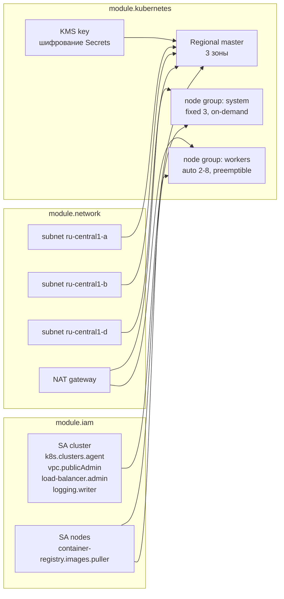

# examples/k8s-cluster

Кластер Managed Service for Kubernetes с региональным мастером, двумя группами узлов и
двумя сервис-аккаунтами с разными правами. Композиция `network` + `iam` + `kubernetes`.

## Схема



## Две группы узлов, а не одна

`system` — фиксированный размер, обычные (не preemptible) узлы, taint
`node-role=system:NoSchedule`. Здесь живут ingress-контроллер, метрики, логи и всё
остальное, без чего кластер перестаёт быть кластером. Потеря такого узла в неудобный
момент стоит дороже, чем экономия на нём.

`workers` — автоскейлинг от 2 до 8 узлов, preemptible. Приложения, которые и так должны
переживать исчезновение пода. Preemptible-узлы примерно втрое дешевле, но платформа
останавливает их не позднее чем через 24 часа, поэтому модуль требует включённого
`auto_repair`.

## Запуск

```bash
cp terraform.tfvars.example terraform.tfvars
# заполнить cloud_id и folder_id

export YC_TOKEN="$(yc iam create-token)"
terraform init
terraform apply
```

Мастер поднимается без публичного адреса, поэтому kubeconfig берётся по внутреннему
эндпоинту — команда возвращается выходом `kubeconfig_command`:

```bash
$(terraform output -raw kubeconfig_command)
kubectl get nodes
```

Для доступа снаружи VPC понадобится бастион или VPN. Публичный API-эндпоинт включается
переменной `master_public_ip` в модуле, но по умолчанию он выключен намеренно.

## Что это стоит

Региональный мастер дороже зонального примерно вдвое и переживает потерю зоны.
Для staging-окружения обычно достаточно `master_type = "zonal"` с одной локацией —
переключение стоит одной строчки в `main.tf`, ни одна другая переменная не меняется.

<!-- BEGIN_TF_DOCS -->
## Requirements

| Name | Version |
|------|---------|
| terraform | >= 1.9.0, < 2.0.0 |
| yandex | ~> 0.225 |

## Inputs

| Name | Description | Type | Default | Required |
|------|-------------|------|---------|:--------:|
| cloud\_id | Yandex Cloud ID. | `string` | n/a | yes |
| folder\_id | Folder everything is created in. | `string` | n/a | yes |
| cluster\_name | Cluster name, also used as the prefix for the network and the service accounts. | `string` | `"platform"` | no |
| default\_zone | Zone the provider uses for resources that do not name one explicitly. | `string` | `"ru-central1-a"` | no |
| kubernetes\_version | Kubernetes minor version for the control plane and the node groups. | `string` | `"1.30"` | no |
| labels | Labels applied to every resource. | `map(string)` | <pre>{<br/>  "example": "k8s-cluster",<br/>  "managed-by": "terraform"<br/>}</pre> | no |
| workers\_max | Upper bound of the autoscaled worker pool. | `number` | `8` | no |
| workers\_min | Lower bound of the autoscaled worker pool. | `number` | `2` | no |

## Outputs

| Name | Description |
|------|-------------|
| cluster\_id | ID of the Managed Kubernetes cluster. |
| cluster\_internal\_endpoint | In-VPC API server endpoint. |
| kubeconfig\_command | Command that writes a kubeconfig entry for this cluster. |
| node\_group\_ids | Node group IDs keyed by node group name. |
| secrets\_kms\_key\_id | KMS key encrypting Kubernetes Secrets. |
| service\_account\_ids | Service accounts created for the cluster. |
| subnet\_ids | Subnet IDs keyed by availability zone. |
<!-- END_TF_DOCS -->