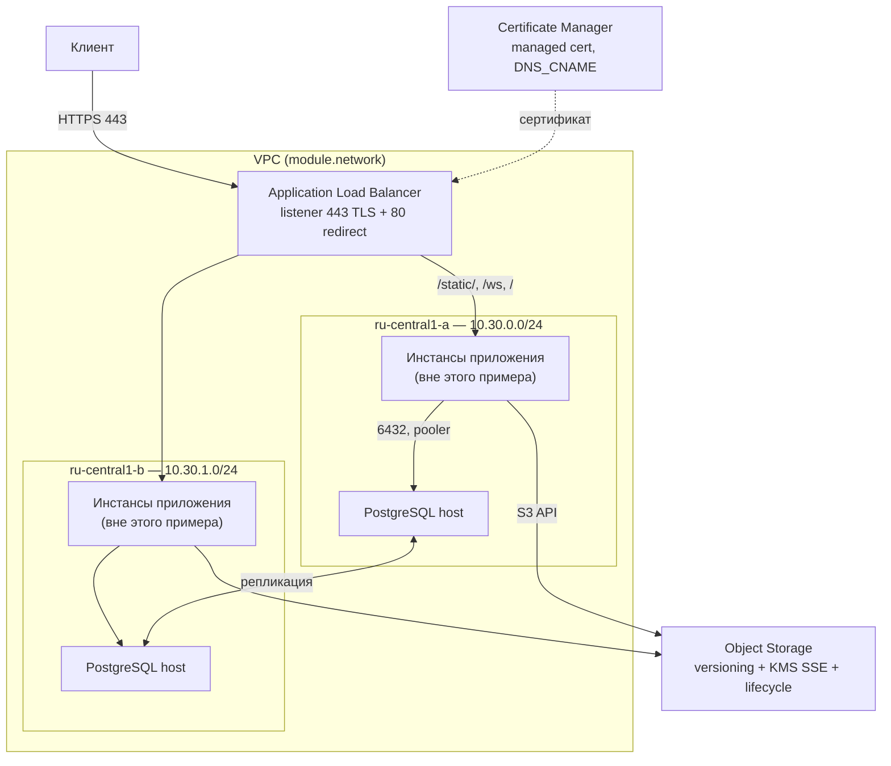

# examples/web-app

Полный стек веб-приложения: сеть, публичный ALB с TLS, кластер PostgreSQL в двух зонах
и бакет для пользовательских загрузок. Композиция `network` + `alb` + `postgresql` +
`object-storage`.

## Схема



## Границы примера

Сами инстансы приложения находятся вне модуля: их запускают группой инстансов,
кластером Kubernetes или чем-то ещё. Пример принимает их приватные адреса переменной
`app_backend_ips` и складывает их в целевую группу балансировщика. Пустой список тоже
допустим — балансировщик поднимется без бэкендов.

## Что здесь сделано осознанно

**Балансировщик — единственный вход извне.** Security-группа `alb` принимает 443 и 80
из интернета, группа `database` принимает 6432 только из подсетей приложения. Больше
никто ничего снаружи не слушает.

**Транзакционный пулинг.** Приложение открывает больше соединений, чем кластер способен
обслужить напрямую, и не полагается на состояние сессии. Отсюда
`pooler_config.pooling_mode = "TRANSACTION"` и порт 6432 в security-группе.

**Два пользователя БД с разной моделью пароля.** Пароль `app` приходит снаружи
(`TF_VAR_db_password`) и попадает в state — иначе приложению его не передать. Пароль
`reporting` генерирует Connection Manager, и Terraform его вообще не видит.

**Три маршрута в ALB и порядок между ними.** `/static/` с коротким таймаутом, `/ws` с
поддержкой websocket и большим idle-таймаутом, `/` последним как catch-all. В ALB
выигрывает первое совпадение, поэтому порядок значим.

**Правила жизненного цикла на бакете.** Загрузки уходят в COLD через 30 дней и удаляются
через два года; неактуальные версии живут 30 дней. Версионирование без второго правила
означает бакет, который только растёт.

## Запуск

```bash
cp terraform.tfvars.example terraform.tfvars
# заполнить cloud_id, folder_id, domain_name, bucket_name

export YC_TOKEN="$(yc iam create-token)"
export TF_VAR_db_password="$(openssl rand -base64 24)"

terraform init
terraform apply
```

Порядок действий после первого `apply`:

1. `terraform output certificate_challenges` — опубликовать CNAME-записи для проверки
   владения доменом. Пока их нет, Certificate Manager сертификат не выпустит.
2. `terraform output load_balancer_address` — направить A-запись домена на этот адрес.
3. Заполнить `app_backend_ips` адресами инстансов приложения и повторить `apply`.

Пароли и ключи читаются только явно и не печатаются в общий вывод:

```bash
terraform output -raw uploads_secret_access_key
```

## Стоимость

Это самый дорогой пример в репозитории: ALB тарифицируется по ресурс-юнитам с минимумом
`min_zone_size = 2` на зону, а кластер PostgreSQL из двух хостов работает круглосуточно.
Для эксперимента имеет смысл поставить `min_zone_size = 1`, один хост БД и
`environment = "PRESTABLE"` — модуль запрещает одну зону только для `PRODUCTION`.
Не забыть `terraform destroy`: `deletion_protection` у кластера включён по умолчанию,
поэтому перед удалением его нужно отключить отдельным `apply`.

<!-- BEGIN_TF_DOCS -->
## Requirements

| Name | Version |
|------|---------|
| terraform | >= 1.9.0, < 2.0.0 |
| yandex | ~> 0.225 |

## Inputs

| Name | Description | Type | Default | Required |
|------|-------------|------|---------|:--------:|
| bucket\_name | Globally unique Object Storage bucket name for user uploads. | `string` | n/a | yes |
| cloud\_id | Yandex Cloud ID. | `string` | n/a | yes |
| db\_password | Password of the application database user. Supply it through a secret store, never in a committed tfvars file. | `string` | n/a | yes |
| domain\_name | Public host name the balancer serves. A managed certificate is requested for it. | `string` | n/a | yes |
| folder\_id | Folder everything is created in. | `string` | n/a | yes |
| app\_backend\_ips | Private IPv4 addresses of the application instances, one entry per instance.<br/>The instances themselves are out of scope for this example - point this at whatever<br/>runs the application (a compute instance group, or nodes of an existing cluster). | <pre>list(object({<br/>    zone       = string<br/>    ip_address = string<br/>  }))</pre> | `[]` | no |
| app\_name | Application name. Prefixes the network, the balancer, the database cluster and the bucket. | `string` | `"shop"` | no |
| app\_port | Port the application listens on. | `number` | `8080` | no |
| db\_disk\_size | Storage per database host in GB. | `number` | `20` | no |
| default\_zone | Zone the provider uses for resources that do not name one explicitly. | `string` | `"ru-central1-a"` | no |
| labels | Labels applied to every resource. | `map(string)` | <pre>{<br/>  "example": "web-app",<br/>  "managed-by": "terraform"<br/>}</pre> | no |

## Outputs

| Name | Description |
|------|-------------|
| certificate\_challenges | DNS records that must exist before Certificate Manager issues the certificate. |
| database\_endpoint | FQDN that always resolves to the current PostgreSQL master. |
| database\_hosts | FQDNs of every database host. |
| load\_balancer\_address | Public IPv4 address of the balancer. Point the A record for the domain at it. |
| network\_id | ID of the VPC network. |
| pitr\_window\_days | How far back the database can be restored. |
| subnet\_ids | Subnet IDs keyed by availability zone. |
| uploads\_access\_key\_id | Access key ID the application uses to talk to the bucket. |
| uploads\_bucket | Name of the uploads bucket. |
| uploads\_secret\_access\_key | Secret key for the bucket. Read it with `terraform output -raw uploads_secret_access_key`. |
<!-- END_TF_DOCS -->